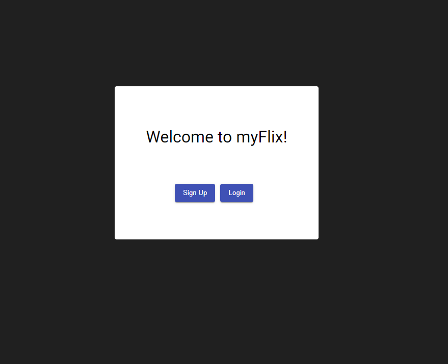
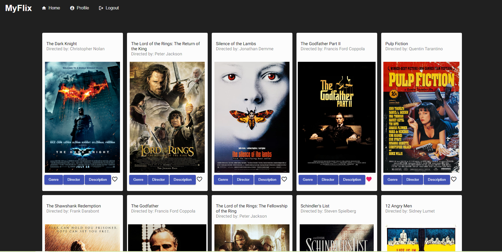
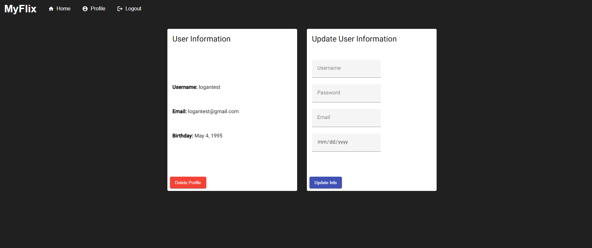

# MyFlixAngular

This Angular client is deployed at [https://loganjlevin.github.io/myFlix-Angular](https://loganjlevin.github.io/myFlix-Angular/welcome).

This project was generated with [Angular CLI](https://github.com/angular/angular-cli) version 15.2.7.

## Description

This is the client side for the full stack MyFlix web application (here is the [React](https://github.com/loganjlevin/myFlix-client) version). The MyFlix web app provides users with access to information about different movies, directors, and genres. Users are able to sign up, view a list of all the movies stored in the database, search for a specific movie, update their personal information, and create a list of their favorite movies.

## Features

- Display a list of all movies to the client
- Display data about a single movie to the client including description, director, genre, image url
- Display the description of a genre
- Display data about director including bio, birth year, death year
- Register a new user
- Update an existing user's information (username, password, email, birthday)
- Add and remove a movie from a user's list of favorites
- Delete an existing user's profile

## Technologies

- Angular 15.2.0
- Angular Material 15.0.0
- Typescript 4.9.4

## Development server

Run `ng serve` for a dev server. Navigate to `http://localhost:4200/`. The application will automatically reload if you change any of the source files.

## Code scaffolding

Run `ng generate component component-name` to generate a new component. You can also use `ng generate directive|pipe|service|class|guard|interface|enum|module`.

## Build

Run `ng build` to build the project. The build artifacts will be stored in the `dist/` directory.

## Running unit tests

Run `ng test` to execute the unit tests via [Karma](https://karma-runner.github.io).

## Running end-to-end tests

Run `ng e2e` to execute the end-to-end tests via a platform of your choice. To use this command, you need to first add a package that implements end-to-end testing capabilities.

## Screenshots

---

---

## Further help

To get more help on the Angular CLI use `ng help` or go check out the [Angular CLI Overview and Command Reference](https://angular.io/cli) page.
